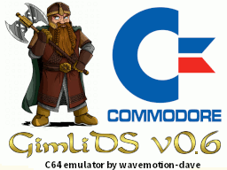
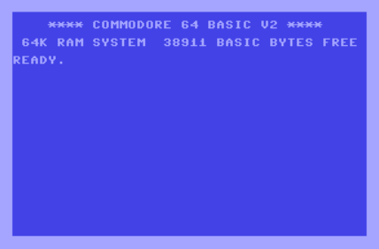

# GimliDS


GimliDS is a C64 Emulator for the DS/DSi and is copyright (c) 2025 Dave Bernazzani (wavemotion-dave)

As GimliDS is a port of the Frodo emulator for the DS/DSi/XL/LL handhelds,
any copying or distribution of this emulator, its source code and associated
readme files, with or without modification, are permitted per the original 
Frodo emulator license shown below.  Hugest thanks to Christian Bauer for his
efforts to provide a clean open-source emulation base for the C64.

Numerous hacks and 'unsafe' optimizations have been performed on the original 
Frodo emulator codebase to get it running on the small handheld system. You 
are strongly encouraged to seek out the official Frodo sources if you're at
all interested in this emulator code.

The GimliDS emulator is offered as-is, without any warranty.

## BIOS Files

You must have original Commodore BIOS files to run this emulator. Place them in /roms/bios or /roms/c64
and be sure they are named exactly as follows:
```
  * KERNAL.ROM   8K  with CRC32=dbe3e7c7 (901227-03)
  * BASIC.ROM    8K  with CRC32=f833d117 (901226-01)
  * CHAR.ROM     4K  with CRC32=ec4272ee (901225-01)
  * 1541.ROM    16K  with CRC32=899fa3c5 (251968-03)
```

## Controls

  * Left Trigger + DPAD - Scale the screen in the X and Y directions
  * Right Trigger + DPAD - Offset the screen in the X and Y directions
  * START - Issue the infamous LOAD "*",8,1 (be sure the emulator is at the READY prompt)
  * SELECT - switch between port1 and port2 that the joystick is in
  * D-Pad - Joystick directions
  * A is normally FIRE but can be remapped in Configuration
  * B is normally SPACE but can be remapped in Configuration
  * Y is normally mapped to RETURN but can be remapped in Configuration
  * X is normally mapped to Joy Up to help with games in which you jump but can be remapped
  * Pressing and holding both shoulder buttons together will 'Turbo Warp' the emulator (runs as fast as it can until you release).

## Emulator Use

To use GimliDS you launch GimliDS.NDS on your DS/DSi/XL/LL. Please note that if you are running from an R4 card (or similar), you 
will be running in 'Compatibility' mode that keeps the CPU at the slower 67MHz. While GimliDS will run, it must use some level 
of light frameskip to get full speed gameplay. If you're running from the SD card on a DSi/XL/LL with something like Twilight Menu++
or Unlaunch - you will be happy to know that you are running at 134MHz and there will be no frameskip and the audio will be 
much improved.

When you first launch the emulator (provided you have the BIOS files in the right place), you will be greeted by the CBM BASIC 
and the famous READY prompt:



From here, use the DISK ICON to load up a new game from a .d64 file. Once mounted, get back to the main emulation (exit the menu)
and press the START button to automatically type in the disk load command:  LOAD "*",8,1 and RUN the game.

The *C=* key (lower right) will let you set the configuration for the game, save/load game states, etc.

And be sure to understand the SELECT key on the DS... that swaps Joystick Ports and you will be using that a LOT as every game seems to
use a different port... and sometimes the game loaders/crackers use one port when the game uses the other port. You'll get used to it.

Also understand that the DS screen resolution of 256x192 is not ideal for the Commodore screen output resolution of 320x200 plus the borders.
To that end, you will be using the L/R shoulder buttons with the D-Pad to scale and offset the screen to get it to look as good as you can.
When you save your configuration for that game, it will remember the scale/offset values you last used. Also, experiement with remapping one
of the DS keys to 'PAN UP' or 'PAN DOWN' which can be used to temporarlily shift the screen by 16 pixels up/down and then the system will
smooth scroll that back into place. That works really well for games that have a high score or status indicator at the very top or bottom
of the screen... you can enjoy nearly full resolution output and just occasionally hit a PAN UP/DN button to see your score. Experiment and
have fun - just like we did in 1982!

There is also a mechanism to temporarily zoom the sceren to a 1:1 ratio. Assign "TOGGLE ZOOM" to any key in configuration and when you press 
that key, the screen will shift into zoomed 1:1 mode for easy text reading. Of course, some of the top/sides will be cut-off but you can use
the L/R shoulder buttons to pan around if needed. Press the same TOGGLE ZOOM button again and the screen will snap back to the pre-zoom settings.

Lastly, a few games use custom loaders that require you to enable 'True Drive'. Be warned that True Drive will render the floppy driver at 
a speed that is comparable to the original Commodore 1541 floppy drive - that is: extremely slow. It could take 2-5 minutes to load a game
this way. But if the game requires it, that's your only option. Recommended to snap out a Save State so you don't have to repeat the loading.

## Cartridge Support

Although primarily a disk-based emulator, GimliDS does support the more common Cart Types up to 1MB. Included here is:

  * Standard 8K
  * Standard 16K
  * Super Game Carts up to 64K
  * Dinamic up to 128K
  * C64 Games System up to 512K
  * Ocean up to 512K
  * Magic Desk up to 1MB
  * Easy Flash up to 1MB with 256b RAM

This should cover a wide number of carts - recommend you seek out the OneLoad64 cart archive.

## Regarding Accuracy

Obviously the emulator is not perfect. It's doing what is known as 'line emulation' - meaning that it executes 1 line of CPU, 1 line of VIC graphics, 1 line of SID music, etc. 
In the PAL world, there are 312 scanlines - of which 200+ are 'visible' on screen. This is fairly typical for my emulators - and many emulators in general. But it's not 
perfectly accurate - as things can change mid-scanline.  And for the C64, some cool effects can be done by careful timing of when certain peripherals (video, sound, etc) are accessed.

To that end - many games don't try to pull off these fancy tricks - and will play reasonably perfectly on the emulator.

But some games use these tricks to a lesser or greater extent. This can result in small graphical glitches (things like a flickering / unstable line near the top or bottom of the playfield) to more extensive 'garbage' on screen or poor audio/music output.

Until I can gain a better understanding and try to improve the emulation (without going FULL cycle-accurate which will cripple the emulation speed), there are some tricks we can pull to help.  One of them is the 'CPU Adjustment' settings in the Configuration (set on a per game basis).

The one that is more interesting is the CPU CYCLES adjustment. This ranges from -9 cycles to +9 cycles with the default being +0 (no adjustment).  This gives the C64 CPU extra cycles to play with on a per-scanline basis. As the beam races down the screen, the CPU and the VIC/SID can get slightly out of alignment... and making an adjustment can help. But be careful - too much adjustment and you're running "out of spec" and could crash the game. 

How would this work... well, if you're not experiencing any weird graphical glitches, you should NOT touch the setting. But let's take Gauntlet which has a slight flicker/flash of the P2 'G' in the lower left of the screen. This kind of flicker is indicative of a timing issue. By pushing the CPU CYCLES adjustment to +2 or +3, the flickering lessens. If you push to +5 it goes away and the screen is nice and stable. You should adjust only as much as is needed to achieve the effect and NO more.  

In general, if you have a scanline instability/flicker near the top of the screen, use slightly negative CPU adjustment values. If the glitch is towards the bottom of the screen... use a slightly positive adjustment value.

## Specific Game Hacks

To get some of the more popular games running as good as possible on the venerable DS, here is a list of things you might try.

  * Gauntlet - set the CPU CYCLES to +5 to eliminate graphical glitches on 'G' font.
  * Bruce Lee - set the CPU CYCLES to +4 to minimize graphical line-based glitches.
  * Turrican I - set the BAD CYCLES to -6 (you will have some corruption on the title screen but the game will look and play fine - most importantly you can actually start the game!).
  * Turrican II - requires True Drive enabled (or load from cart).
  * Lode Runner - requires True Drive enabled (or load from cart).
  * LED Storm - set CPU CYCLES to +4 to eliminate top line graphical glitch.

## Acknowledgements

  * The opening jingle was done by DeNL and comes courtesy of the roalty free jingles at pixabay.
  * The dwarf icon on the title screen was submitted online by 'anonymous' to an artwork site.  If this is yours and you would like to be credited, please contact me.
  * Christian Bauer - Original Frodo author - without whom none of this exists!
  * Troy Davis(GPF) http://gpf.dcemu.co.uk - FrodoDS initial porter and others who have contributed over the years.
  * Wintermute and the contributors for devkitpro and libnds.
  * djleviticus for his time and efforts in helping shake out some bugs during the beta testing.

## Why GimliDS?

Well - this is not enitrely a classic Frodo emulator but is clearly derived from those sources. Mainline Frodo has taken many great steps forward in recent years to be 
more accurate and generally is a couple of full notches above where this port sits. My emulator is largely taken from older DS ports that used Frodo 4.2 (circa 2007) as
a codebase and numerous tweaks and hacks were done to get it running on the venerable DS hardwarwe. I've taken that and tried to back-port some of the newer Frodo mainline
improvements but also add my own tweaks and hacks to make it fully playable on the little handheld. As such, the GimliDS naming is a clear nod to the original emulator
but also distinguishes it as a bit rough around the edges...

## Original Frodo Copyright
```
Frodo Copyright (C) Christian Bauer

This program is free software; you can redistribute it and/or modify
it under the terms of the GNU General Public License as published by
the Free Software Foundation; either version 2 of the License, or
(at your option) any later version.

This program is distributed in the hope that it will be useful,
but WITHOUT ANY WARRANTY; without even the implied warranty of
MERCHANTABILITY or FITNESS FOR A PARTICULAR PURPOSE.  See the
GNU General Public License for more details.

You should have received a copy of the GNU General Public License
along with this program; if not, write to the Free Software
Foundation, Inc., 59 Temple Place, Suite 330, Boston, MA  02111-1307  USA
```
## Change Log

Version 1.1 release 11-May-2025 by wavemotion-dave
  * Fix to CIA vars initialization so games like Chuckie Egg start properly.
  * Fix to TOD clock counters (previous versions would not clock at all... fixes some utilities mostly).
  * Improved REU handling for a bit more speed (gain of 1-2 frames on REU games)
  * Improved VIC handling for a bit more speed (gain of 1-2 frames across the board)

Version 1.0 release 09-May-2025 by wavemotion-dave
  * Added TOGGLE ZOOM button map to scale screen 1:1 temporarily (to make text games readable)
  * Another proper fix for CPU jump commands not handling the extra cycle it takes.
  * Fixed CPU zero-page wrap so it's accurate.
  * Added 256K REU-1764 support. Still quite preliminary.
  * A bit of polish and cleanup for the big first release!

Version 0.9d release 06-May-2025 by wavemotion-dave
  * Added ability to remap the British Pound (£) symbol to one of the other rare missing keys (left arrow, up arrow, C=)
  * Fix for CPU jump commands not handling the extra cycle it takes.
  * All carts insertions do a proper reset so that we don't lock up when switching carts.
  * Minor cartridge accuracy improvements - new LED added to cart icon for EasyFlash loading.

Version 0.9b/c release 05-May-2025 by wavemotion-dave
  * Pressing L+R shoulder buttons together is WARP mode (run emulator fast while the buttons are held)
  * Improved L/R + DPAD scale/offset (so it doesn't also produce joystick input at the same time)
  * Minor tweaks to TrueDrive mode for improved cycle accuracy
  * CRT and PRG Cartridge support. Most popular game-based formats are supported. Use the new CART icon.
  * 0.9c hot-fix release fixes the Cartridge Menu graphic and adds a bit more speed for the DS-Lite.

Version 0.9a release 02-May-2025 by wavemotion-dave
  * Fixed TrueDrive loading so it doesn't alter the CPU speed (for games like Pang which were playing quite 'uneven').
  * Bumped up volume of the SID output by 50% (was too quiet)
  * Improved 1541 Drive emulation - mostly in the GCR and IEC areas. Nothing noticeable but should be more accurate.
  * Fixed write floppy icon color (instead of the usual green, will flash blue).
  * Tweaks to C64 keyboard graphic to be more authentic.

Version 0.9 release 30-Apr-2025 by wavemotion-dave
  * New and improved key mapping - including the new Slide-n-Glide joysticks handling.
  * SID filtering improved for better audio rendering (Space Taxi voice heard!).
  * Faster across the board - even the DS-Lite/Phat is now running at (or close to) full speed.
  * Fixed joystick handling so we sample at the correct rate - smoother motion on screen.

Version 0.8 release 27-Apr-2025 by wavemotion-dave
  * First public beta released!

